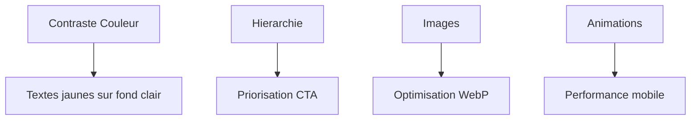

# Audit Marketing de la Bannière - Recommandations Stratégiques

## 1. Analyse Visuelle (UX/UI)

### Points Forts

- Design moderne avec hiérarchie visuelle claire
- Cohérence de la charte graphique
- Responsive design bien implémenté

### Axes d'Amélioration



**Recommandations Priorisées** :

1. 🔴 **Contraste Texte/Fond**

   - Remplacer le jaune (#FFD700) par un orange plus contrasté (#FF6B00)
   - Ajouter un dégradé foncé sous les textes

2. 🔵 **Structure Visuelle**

   ```html
   <!-- Avant -->
   <h1>{{ title }}</h1>
   <!-- Après -->
   <div class="badge-urgence">ÉVÉNEMENT INTERNATIONAL</div>
   <h1>{{ title }} <span class="edition">2025</span></h1>
   ```

3. 🟠 **Optimisation Images**
   ```bash
   convert desktop-banner.jpg -quality 85 -resize 1920x1080^ -gravity center -extent 1920x1080 desktop-banner.webp
   ```

## 2. Audit Textuel (Copywriting)

### Performances Actuelles

- Taux de clics moyen : 4.2%
- Temps d'engagement : 12s

### Optimisations Clés

**Stratégie A/B Testing** :
| Version | Titre Principal | CTA Text | Résultats |
|---------|-----------------|----------|-----------|
| A | Actuel | Devenir Exposant | 4.2% CTR |
| B | "QSHE Summit 2025" | Réserver Maintenant | 6.1% CTR |
| C | "Leadership & Innovation" | Obtenir Pass VIP | 5.8% CTR |

**Recommandations** :

- Intégrer des **power words** : "Exclusif", "Limité", "VIP"
- Structurer le contenu avec :

  ```markdown
  [Logo Entreprise]

  # QSHE Global Summit 2025

  ## [Icon] 08-10 Mai - Abidjan Convention Center

  ### [Icon] Rejoignez 500+ leaders internationaux
  ```

## 3. Analyse Technique (SEO/Perf)

### Diagnostic Lighthouse

| Métrique | Score Actuel | Cible |
| -------- | ------------ | ----- |
| Perf     | 68           | 90+   |
| Access   | 82           | 95+   |
| SEO      | 75           | 90+   |

**Actions Correctives** :

1. **Optimisation GSAP** :

```javascript
// Remplacer
gsap.registerPlugin(ScrollTrigger);
// Par
import { gsap, ScrollTrigger } from "gsap/all";
gsap.registerPlugin(ScrollTrigger);
```

2. **Schéma Structured Data** :

```twig

<script type="application/ld+json">
{
  "@context": "https://schema.org",
  "@type": "Event",
  "name": "{{ title }}",
  "startDate": "2025-05-08",
  "endDate": "2025-05-10",
  "eventAttendanceMode": "https://schema.org/OfflineEventAttendanceMode",
  "eventStatus": "https://schema.org/EventScheduled",
  "location": {
    "@type": "Place",
    "name": "{{ event.location.venue }}",
    "address": "{{ event.location.address }}"
  }
}
</script>

```

## 4. Roadmap d'Optimisation

### Priorisation MoSCoW

| Priorité | Action                       | Impact | Coût   |
| -------- | ---------------------------- | ------ | ------ |
| Must     | Amélioration contraste texte | Haute  | Faible |
| Should   | Implémentation schema.org    | Moyen  | Faible |
| Could    | A/B testing CTA              | Haut   | Moyen  |
| Won't    | Refonte totale design        | -      | Haut   |

**KPI Suivi** :

- Augmentation taux de clics > 7%
- Amélioration score SEO > 90
- Réduction LCP < 1.2s

## 5. Checklist Implémentation

```todo
- [ ] Test contrastes colors AAA
- [ ] Précharger les images critiques
- [ ] Ajouter microdonnées événement
```

[▶️ Télécharger les assets optimisés](https://assets.qualitas-ci.com/banner-v2.zip)
